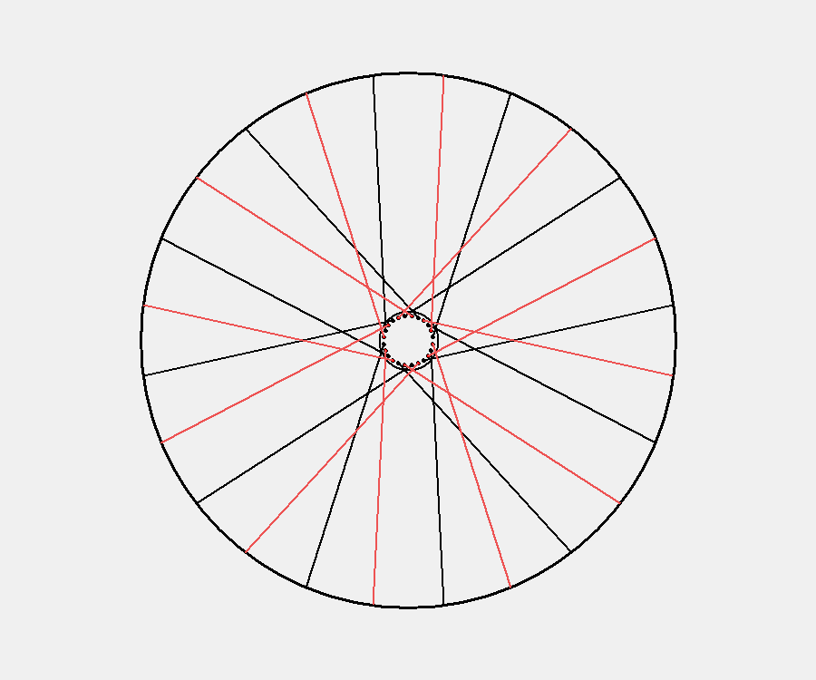

# Bicycle Wheel Spoke Length Calculator

This command line application allows a user to enter in hub and rim measurements to derive the spoke length required for lacing and building a bicycle wheel. It allows for any lacing pattern from radial to 4 cross and will warn the user of invalid configurations.

This is a work in progress and I am currently working on a GUI version to represent the spoke lengths visually.

